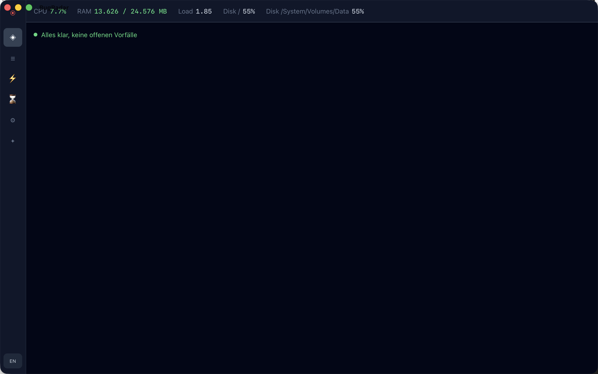

<div align="center">
  

  <h1>BugRadar</h1>
</div>

[🇬🇧 English Version](README.md)

**KI-gestütztes Echtzeit-Diagnose- und Monitoring-Tool, entwickelt mit Rust und Tauri.**

BugRadar überwacht Logdateien, Docker-Container und Systemmetriken in Echtzeit, erkennt Anomalien automatisch, gruppiert sie zu Incidents und generiert AI-basierte Root-Cause-Analysen mit konkreten Fix-Vorschlägen.

[](https://github.com/9t29zhmwdh-coder/BugRadar/actions) [](https://github.com/9t29zhmwdh-coder/BugRadar/security/code-scanning) [](https://securityscorecards.dev/viewer/?uri=github.com/9t29zhmwdh-coder/BugRadar) [](https://bestpractices.dev/projects/13716)

      

> **So läuft es:** BugRadar ist eine native Desktop-App, kein Server oder Browser-Tool. Sie öffnet sich als eigenes Fenster, ohne Tray-Icon oder Hintergrunddienst; sie überwacht Quellen und erfasst Metriken nur, während das Fenster geöffnet ist.



---

> 💾 **Download:** [macOS (DMG)](https://github.com/9t29zhmwdh-coder/BugRadar/releases/latest/download/BugRadar.dmg) · [Windows (Installer)](https://github.com/9t29zhmwdh-coder/BugRadar/releases/latest/download/BugRadar-Setup.exe) · [Linux (AppImage)](https://github.com/9t29zhmwdh-coder/BugRadar/releases/latest/download/BugRadar.AppImage): immer die neueste Version, nicht codesigniert/notarisiert (Gatekeeper/SmartScreen warnen beim ersten Start). Oder aus dem Quellcode bauen, siehe Getting Started unten.

---

> 🌱 Neu hier? → [Schritt-für-Schritt-Anleitung für Einsteiger](GETTING_STARTED.md)

---

Die Oberfläche von BugRadar ist auf Englisch (Standard) und Deutsch verfügbar; umschaltbar über den Sprachtoggle unten links.

**In der Praxis:** du zeigst BugRadar auf eine Logdatei oder einen Docker-Container, es markiert Anomalien (Fehler-Spikes, Latenz-Sprünge) sobald sie auftreten, gruppiert zusammengehörige zu einem Incident und lässt auf Wunsch Claude oder ein lokales Ollama-Modell die Ursache mit konkreten Lösungsvorschlägen erklären.

## Funktionen

| Funktion | Beschreibung |
|---|---|
| **Log-Überwachung** | Echtzeit File-Tailing + Docker-Container Log-Streaming |
| **Multi-Format-Parser** | JSON, Plaintext, Nginx, Docker: mit Stacktrace-Zusammenführung |
| **Anomalie-Erkennung** | Rolling-Window-Analyse: Fehler-Spikes, Latenz-Sprünge, Memory Leaks |
| **Incident-Gruppierung** | Korreliert Anomalien innerhalb konfigurierbarer Zeitfenster |
| **KI-Root-Cause-Analyse** | Claude (Anthropic API, Standard) oder lokales Ollama generiert strukturierte Fix-Vorschläge |
| **System-Monitoring** | CPU, RAM, Disk, Netzwerk, Docker-Container-Status |
| **Config-Inspector** | Analysiert YAML/JSON/TOML-Dateien auf Fehler und Konflikte |
| **Timeline-Ansicht** | Recharts-basierte Anomalie-Timeline und Heatmap |
| **Eigene Detektoren** | Eigene ausführbare Datei als Detektor einbinden, in jeder Sprache: Einstellungen → Eigene Detektoren |

---

## Voraussetzungen

- [Rust](https://rustup.rs/) 1.77+
- [Node.js](https://nodejs.org/) 20+
- [Tauri CLI v2](https://tauri.app/): `cargo install tauri-cli`
- Ein [Anthropic API-Key](https://console.anthropic.com/) (Standard-Anbieter) oder lokal laufendes [Ollama](https://ollama.ai) (optional, für KI-Ursachenanalysen)
- macOS / Windows / Linux

---

## Schnellstart

```bash
git clone https://github.com/9t29zhmwdh-coder/BugRadar
cd BugRadar

cd frontend && npm install && cd ..
cargo tauri dev
```

### Nur CLI

```bash
cargo install --path crates/br-cli

bugradar inspect /etc/nginx/nginx.conf
bugradar metrics
bugradar incidents --open
```

---

## Deinstallation / Aufräumen

- App-Bundle löschen
- Lokale Datenbank entfernen: plattformspezifisches App-Datenverzeichnis (`bugradar.sqlite`), aufgelöst über Tauris `app_data_dir`
- Gespeicherten API-Key aus der Schlüsselbundverwaltung.app entfernen (suche nach "BugRadar")

Es bleiben keine weiteren Dateien oder Hintergrunddienste zurück.

---

## KI-Anbieter

| Anbieter | Einrichtung |
|---|---|
| **Claude (Anthropic)** | Standard. API-Key in Einstellungen eingeben, im Betriebssystem-Schlüsselbund gespeichert |
| **Ollama (lokal)** | [Ollama](https://ollama.ai) installieren, `ollama pull llama3.2` ausführen, Host/Modell in den Einstellungen setzen |

Die KI-Analyse läuft auf Anfrage: Klick auf "KI-Analyse starten" bei einem Incident. (Automatisches Auslösen bei High-Severity-Incidents mit 3+ Anomalien ist in `Incident::should_trigger_ai()` implementiert, aber noch nicht an den Collector angebunden, siehe ROADMAP.md.)

---

## Eigene Detektoren

Neben den eingebauten Detektoren (Fehler-Spitze, Latenz-Sprung, Memory Leak) kann BugRadar eine eigene ausführbare Datei als Detektor ausführen, in jeder Sprache. Einrichtung unter Einstellungen → Eigene Detektoren: ein Befehl, optionale Argumente und ein Timeout.

Einmal pro Tick, für jede aktive Log-Quelle, startet BugRadar den konfigurierten Befehl als frischen Subprozess, schreibt eine JSON-Zeile mit dem aktuellen Fenster-Zustand der Quelle auf dessen stdin und liest eine JSON-Zeile mit Anomalien von dessen stdout zurück:

```json
// stdin (BugRadar → Plugin)
{
  "source_id": "app-1",
  "total_entries": 812,
  "error_count_last_tick": 3,
  "warn_count_in_window": 5,
  "error_rate_mean": 1.2,
  "latency_samples_ms": [42.1, 58.0],
  "recent_messages": ["disk full: /var", "..."]
}
```

```json
// stdout (Plugin → BugRadar)
{
  "anomalies": [
    { "label": "disk full", "value": 9.0, "baseline": 1.0, "contributing_entries": ["disk full: /var"] }
  ]
}
```

Ein minimales Python-Beispiel (jede ausführbare Datei funktioniert, dies ist nur das portabelste zum Copy-Paste):

```python
#!/usr/bin/env python3
import json, sys

request = json.load(sys.stdin)
anomalies = []
if any("disk full" in m for m in request["recent_messages"]):
    anomalies.append({"label": "disk full", "value": 1.0, "baseline": 0.0,
                       "contributing_entries": request["recent_messages"]})
json.dump({"anomalies": anomalies}, sys.stdout)
```

Das läuft als Subprozess, nicht als dynamisch geladene Bibliothek: Rust garantiert keine ABI-Stabilität über Compiler-Versionen hinweg, ein per `dlopen` geladenes Plugin, das mit einem anderen rustc als BugRadar selbst kompiliert wurde, wäre Undefined Behavior, das nur auf seinen Auftritt wartet. Eine Prozessgrenze vermeidet das vollständig und erlaubt einen Detektor in jeder Sprache, auf Kosten eines kleinen Spawn-Overheads pro Tick. Ein fehlerhaftes Plugin (Absturz, ungültiges JSON, Timeout) lässt nur dessen Befunde für diesen Tick wegfallen; es betrifft nie die eingebauten Detektoren oder andere Quellen.

---

## Architektur

```
BugRadar/
├── crates/br-core/      # Rust: Collector, Anomalie-Engine, KI, Sysmon, DB
├── crates/br-cli/       # CLI-Binary (bugradar)
├── src-tauri/           # Tauri v2 Backend + IPC-Commands
└── frontend/            # React + TypeScript + Tailwind + Recharts
```

### Datenfluss

```
LogCollector ──► AnomalyEngine ──► IncidentGrouper
     │               │                    │
  File/Docker      1s Tick            AI-Trigger
  Tail/Stream      detect            (Debounced)
                   Anomalie
```

---

**Autor:** [Rafael Yilmaz](https://github.com/9t29zhmwdh-coder) · **Status:** Active ·  · **Lizenz:** MIT
