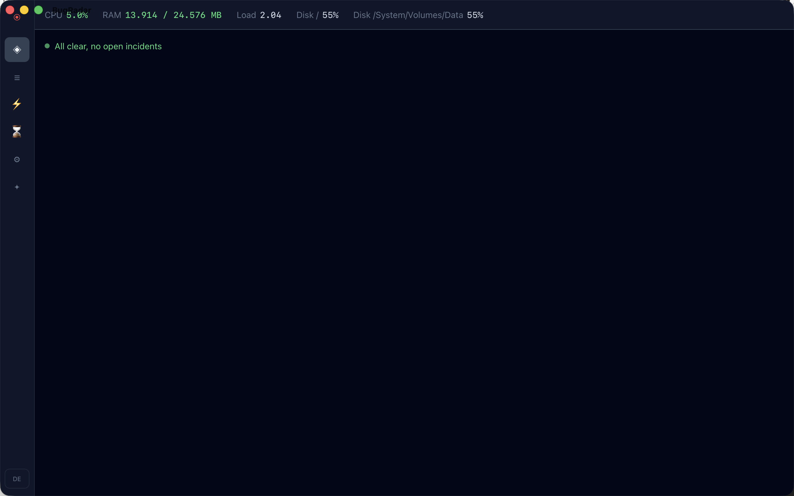

<div align="center">
  

  <h1>BugRadar</h1>

</div>

[🇩🇪 Deutsche Version](README.de.md)

**AI-powered real-time diagnostics and monitoring tool, built with Rust and Tauri.**

BugRadar watches your log files, Docker containers, and system metrics in real-time, automatically detects anomalies, groups them into incidents, and generates AI-driven root-cause analyses with actionable fix suggestions.

[](https://github.com/9t29zhmwdh-coder/BugRadar/actions)       

> **How it runs:** BugRadar is a native desktop app, not a server or browser tool. It opens as its own window and has no tray icon or background service; it only watches sources and collects metrics while the window is open.



---

> 💾 **Download:** [macOS (DMG)](https://github.com/9t29zhmwdh-coder/BugRadar/releases/latest/download/BugRadar.dmg) · [Windows (Installer)](https://github.com/9t29zhmwdh-coder/BugRadar/releases/latest/download/BugRadar-Setup.exe) · [Linux (AppImage)](https://github.com/9t29zhmwdh-coder/BugRadar/releases/latest/download/BugRadar.AppImage): always the latest release, not code-signed/notarized (Gatekeeper/SmartScreen will warn on first run). Or build from source, see Getting Started below.

---

> 🌱 New here? → [Step-by-step guide for beginners](GETTING_STARTED.md)

---

BugRadar's UI is available in English (default) and German; switch anytime with the language toggle in the bottom-left corner.

**In practice:** you point BugRadar at a log file or Docker container, it flags anomalies (error spikes, latency jumps) as they happen, groups related ones into a single incident, and on request asks Claude or a local Ollama model to explain the root cause with concrete fix suggestions.

## Features

| Feature | Description |
|---|---|
| **Log Watching** | Real-time file tailing + Docker container log streaming |
| **Multi-Format Parsing** | JSON, plaintext, nginx, Docker: with stacktrace merging |
| **Anomaly Detection** | Rolling-window analysis: error spikes, latency jumps, memory leaks |
| **Incident Grouping** | Correlates anomalies into incidents within configurable time windows |
| **AI Root-Cause Analysis** | Claude (Anthropic API, default) or a local Ollama model generates structured fix suggestions |
| **System Monitoring** | CPU, RAM, Disk, Network, Docker container status |
| **Config Inspector** | Analyzes YAML/JSON/TOML files for issues and conflicts |
| **Timeline View** | Recharts-powered anomaly timeline and heatmap |
| **Custom Detectors** | Plug in your own executable as a detector, in any language: Settings → Custom Detectors |

---

## Requirements

- [Rust](https://rustup.rs/) 1.77+
- [Node.js](https://nodejs.org/) 20+
- [Tauri CLI v2](https://tauri.app/): `cargo install tauri-cli`
- An [Anthropic API key](https://console.anthropic.com/) (default AI provider) or [Ollama](https://ollama.ai) running locally (optional, for AI root-cause explanations)
- macOS / Windows / Linux

---

## Quick Start

```bash
git clone https://github.com/9t29zhmwdh-coder/BugRadar
cd BugRadar

cd frontend && npm install && cd ..
cargo tauri dev
```

### CLI Only

```bash
cargo install --path crates/br-cli

bugradar inspect /etc/nginx/nginx.conf
bugradar metrics
bugradar incidents --open
```

---

## Uninstall / Cleanup

- Delete the app bundle
- Remove the local database: platform-specific app data directory (`bugradar.sqlite`), resolved via Tauri's `app_data_dir`
- Remove the stored API key from Keychain Access.app (search for "BugRadar")

No other files or background services are left behind.

---

## AI Providers

| Provider | Setup |
|---|---|
| **Claude (Anthropic)** | Default. Add your API key in Settings; stored in the OS keychain |
| **Ollama (local)** | Install [Ollama](https://ollama.ai), run `ollama pull llama3.2`, set the host/model in Settings |

AI analysis runs on demand: click "Run AI Analysis" on any incident. (Auto-triggering for High-severity incidents with 3+ anomalies is implemented in `Incident::should_trigger_ai()` but not wired up to the collector yet, see ROADMAP.md.)

---

## Custom Detectors

Beyond the built-in detectors (error spike, latency jump, memory leak), BugRadar can run your own executable as a detector, in any language. Configure one in Settings → Custom Detectors: a command, optional arguments, and a timeout.

Once per tick, for every active log source, BugRadar spawns your command as a fresh subprocess, writes one JSON line describing that source's current window to its stdin, and reads one JSON line of anomalies back from its stdout:

```json
// stdin (BugRadar → your plugin)
{
  "source_id": "app-1",
  "total_entries": 812,
  "error_count_last_tick": 3,
  "warn_count_in_window": 5,
  "error_rate_mean": 1.2,
  "latency_samples_ms": [42.1, 58.0],
  "recent_messages": ["disk full: /var", "..."]
}
```

```json
// stdout (your plugin → BugRadar)
{
  "anomalies": [
    { "label": "disk full", "value": 9.0, "baseline": 1.0, "contributing_entries": ["disk full: /var"] }
  ]
}
```

A minimal Python example (any executable works, this is just the most portable to paste):

```python
#!/usr/bin/env python3
import json, sys

request = json.load(sys.stdin)
anomalies = []
if any("disk full" in m for m in request["recent_messages"]):
    anomalies.append({"label": "disk full", "value": 1.0, "baseline": 0.0,
                       "contributing_entries": request["recent_messages"]})
json.dump({"anomalies": anomalies}, sys.stdout)
```

This runs as a subprocess, not a dynamically loaded library: Rust gives no ABI stability guarantee across compiler versions, so a `dlopen`'d plugin compiled with a different rustc than BugRadar itself would be undefined behavior waiting to happen. A process boundary avoids that entirely and lets a detector be written in any language, at the cost of a small per-tick spawn overhead. A misbehaving plugin (crash, invalid JSON, timeout) only drops that plugin's findings for that tick; it never affects the built-in detectors or other sources.

---

## Architecture

```
BugRadar/
├── crates/br-core/      # Rust: collector, anomaly detection, AI, sysmon, DB
├── crates/br-cli/       # CLI binary (bugradar)
├── src-tauri/           # Tauri v2 backend + IPC commands
└── frontend/            # React + TypeScript + Tailwind + Recharts
```

### Data Flow

```
LogCollector ──► AnomalyEngine ──► IncidentGrouper
     │               │                    │
  File/Docker      1s tick            AI Trigger
  tail/stream      detect            (debounced)
                   anomaly
```

---

**Author:** [Rafael Yilmaz](https://github.com/9t29zhmwdh-coder) · **Status:** Active ·  · **License:** MIT